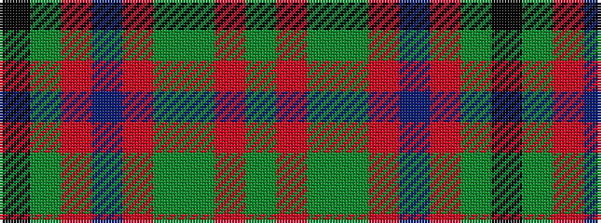

GRGGRBRGK

It is a 9 stripe tartan.

<figure class="pat-woven">

<figcaption>idealised sample</figcaption>
</figure>

## Colour Sequence



## Tartans with this colour sequence

| Tartans |
|---------------|
| [Land's End (Unnamed Maroon)](/variants/s9/k23y2m3db7m3y2dg15m21y5~x2/)|
||
