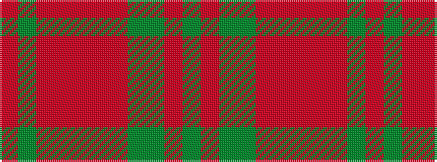

GRGGRRRRRGR

It is a 11 stripe tartan.

<figure class="pat-woven">

<figcaption>idealised sample</figcaption>
</figure>

## Colour Sequence



## Tartans with this colour sequence

| Tartans |
|---------------|
| [Portosalvo (Corporate)](/variants/s11/o5g1o32r1o8r9o2g2g3r3g1~x2/)|
||
