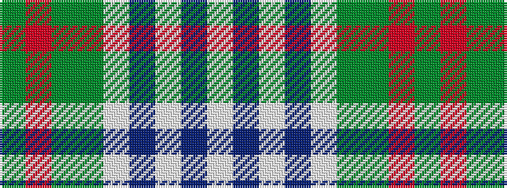

GRGGWBWBW

It is a 9 stripe tartan.

<figure class="pat-woven">

<figcaption>idealised sample</figcaption>
</figure>

## Colour Sequence



## Tartans with this colour sequence

| Tartans |
|---------------|
| [Gaelic College of St.Anns](/setts/s9/g8r1g4dy2w4t3w1t3w4~x8/)|
||
