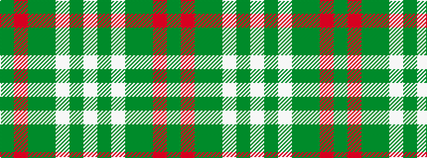

GRGGWGW

It is a 7 stripe tartan.

<figure class="pat-woven">

<figcaption>idealised sample</figcaption>
</figure>

## Colour Sequence



## Tartans with this colour sequence

| Tartans |
|---------------|
| [Uist, Green (Dance)](/variants/s7/g3r2g27dg3w30dg2w3~x2/)|
||
