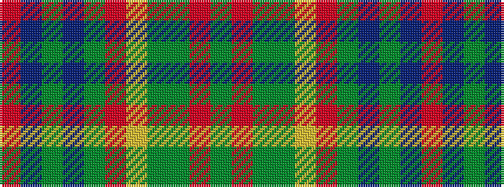

GRGGYRGBGBR

It is a 11 stripe tartan.

<figure class="pat-woven">

<figcaption>idealised sample</figcaption>
</figure>

## Colour Sequence



## Tartans with this colour sequence

| Tartans |
|---------------|
| [Unidentified Chair Covering](/variants/s11/r15dp3dy2do2dy3r3lo3dy3g3r4g2~x2/)|
||
