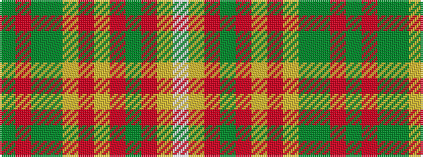

GRGGYRYRGRYW

It is a 12 stripe tartan.

<figure class="pat-woven">

<figcaption>idealised sample</figcaption>
</figure>

## Colour Sequence



## Tartans with this colour sequence

| Tartans |
|---------------|
| [Flodden](/variants/s12/g2r2g2dy14ly2r3ly1r1dg20r3ly1w2~x2/)|
||
