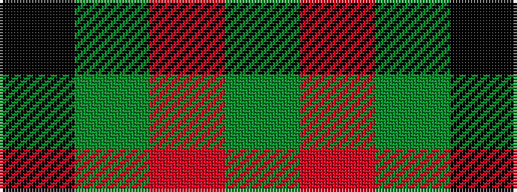

GRGK

It is a 4 stripe tartan.

<figure class="pat-woven">

<figcaption>idealised sample</figcaption>
</figure>

## Colour Sequence



## Tartans with this colour sequence

| Tartans |
|---------------|
| [Glen Lyon #1](/variants/s4/k6g5r2~x2/)|
||
| [Wilson's No.187](/variants/s4/k1g1r1~x8/)|
||
