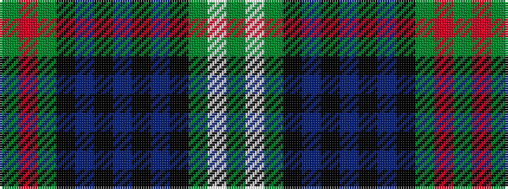

GRGKBKBKBKGWG

It is a 13 stripe tartan.

<figure class="pat-woven">

<figcaption>idealised sample</figcaption>
</figure>

## Colour Sequence



## Tartans with this colour sequence

| Tartans |
|---------------|
| [Mack Original (Personal)](/variants/s13/g2r2g21k8t8k2t28k2t8k8g21w2g2~x2/)|
||
