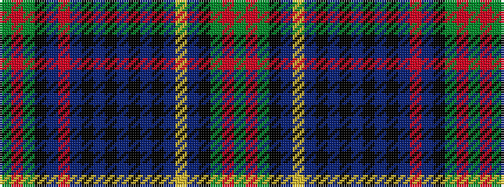

GRGKBRBKBKBKBKBYBKGRG

It is a 21 stripe tartan.

<figure class="pat-woven">

<figcaption>idealised sample</figcaption>
</figure>

## Colour Sequence



## Tartans with this colour sequence

| Tartans |
|---------------|
| [Allen (1998)](/variants/s21/g2r2g12k4n11r2n11k4n2k9n2k9n2k4n11ly2n11k4g12r2g2~x2/)|
||
| [Allen, Christopher Holler](/variants/s21/g2r2g12k4db11r2db11k4db2k9db2k9db2k4db11ly2db11k4g12r2g2~x2/)|
||
