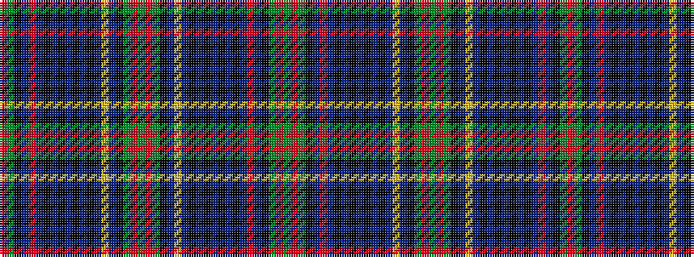

GRGKBRBKBKBKBKBYBKGRGRGKBYBKBKBKBKBRBKGR

It is a 40 stripe tartan.

<figure class="pat-woven">

<figcaption>idealised sample</figcaption>
</figure>

## Colour Sequence



## Tartans with this colour sequence

| Tartans |
|---------------|
| [Allen Personal Tartan Tartan Number: 2482. Earliest known date: 1997 Designed for Christopher Allen Holler of Winter Park Florida and for use by anyone of the name Allen or any of its variations. See products available Copyright © Blair Urquhart, Comrie, 2015](/setts/s40/r2g12k4db11r2db11k4db2k9db2k9db2k4db11ly2db11k4g12r2g2r2g12k4db11ly2db11k4db2k9db2k9db2k4db11r2db11k4g12r2g2~x2/)|
||
