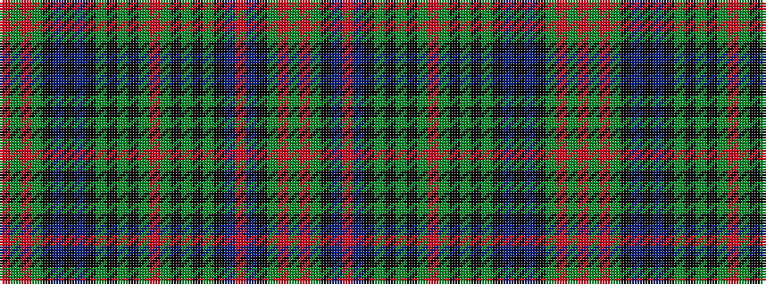

GRGKBRBKGKGKGRGKGKGKBKBKGRGR

It is a 28 stripe tartan.

<figure class="pat-woven">

<figcaption>idealised sample</figcaption>
</figure>

## Colour Sequence



## Tartans with this colour sequence

| Tartans |
|---------------|
| [Shearer (Name)](/setts/s28/y4oi2y11k9do12o2do12k9y2k2y2k2y6r2y6k2y2k2y2k9do12k2do12k9y11oi2y4r2~x2/)|
||
