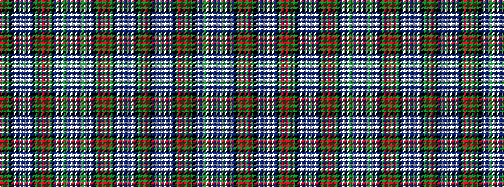

GRGKBWBWBWBWBKGRGRGRGKBWBWGWBWBWBWGWBWBKGRGRGRGKBWBWBWBWBKGRGR

It is a 62 stripe tartan.

<figure class="pat-woven">

<figcaption>idealised sample</figcaption>
</figure>

## Colour Sequence



## Tartans with this colour sequence

| Tartans |
|---------------|
| [Unidentified Lindley #7](/variants/s62/b3w1b1w1g22w1b1w1b3k11g22r1g1r2g1r1g22k11b16w1b4w1b16w1b4w1b16k11g22r1g1r2~x2/)|
||
