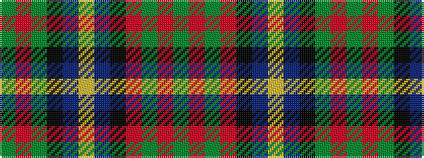

GRGKBYBKRGRG

It is a 12 stripe tartan.

<figure class="pat-woven">

<figcaption>idealised sample</figcaption>
</figure>

## Colour Sequence



## Tartans with this colour sequence

| Tartans |
|---------------|
| [Akins of Candler (Personal)](/setts/s12/g12r2g2r2k12db12ly2db12k2g11r2g2~x2/)|
||
