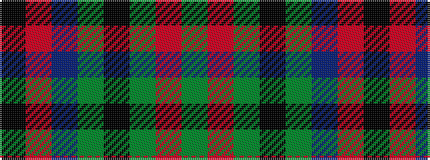

GRGKGBRK

It is a 8 stripe tartan.

<figure class="pat-woven">

<figcaption>idealised sample</figcaption>
</figure>

## Colour Sequence



## Tartans with this colour sequence

| Tartans |
|---------------|
| [Dickie](/setts/s8/g8r2g12k6g3db6r24k4~x2/)|
||
