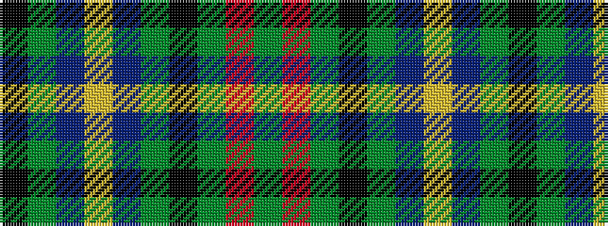

GRGKGBYBGK

It is a 10 stripe tartan.

<figure class="pat-woven">

<figcaption>idealised sample</figcaption>
</figure>

## Colour Sequence



## Tartans with this colour sequence

| Tartans |
|---------------|
| [Casely Family Tartan](/variants/s10/k19g3db19lo5db19g3k19g19r7g19~x2/)|
||
