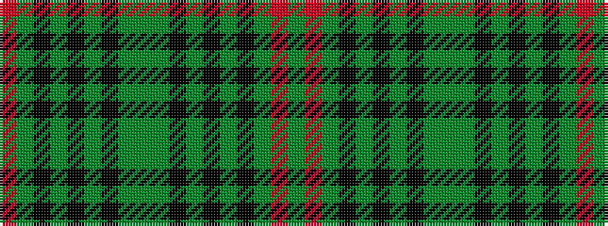

GRGKGKGKGGGKGKGKGR

It is a 18 stripe tartan.

<figure class="pat-woven">

<figcaption>idealised sample</figcaption>
</figure>

## Colour Sequence



## Tartans with this colour sequence

| Tartans |
|---------------|
| [Orvis Sports Company](/variants/s18/dg4r4dg60k4dg4k1y2k1dg4y36dg4k1y2k1dg4k4dg60r4~x2/)|
||
