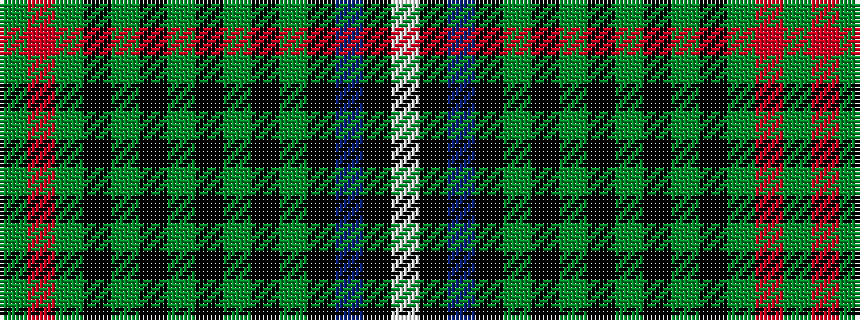

GRGKGKGKGKGKBKW

It is a 15 stripe tartan.

<figure class="pat-woven">

<figcaption>idealised sample</figcaption>
</figure>

## Colour Sequence



## Tartans with this colour sequence

| Tartans |
|---------------|
| [MacKean Hunting](/setts/s15/g2r4g2k16g2k16g4k2g2k2g4k4db8k1lb2~x2/)|
||
| [MacKean Hunting Family Tartan Tartan Number: 985. Earliest known date: 1987 1987 See products available Copyright © Blair Urquhart, Comrie, 2015](/setts/s15/g2r4g2k16g4k16g4k2g2k2g4k4db8k1w2~x2/)|
||
