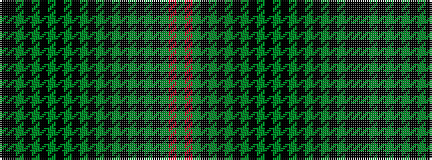

GRGKGKGKGKGKGKGKGKGKGKK

It is a 23 stripe tartan.

<figure class="pat-woven">

<figcaption>idealised sample</figcaption>
</figure>

## Colour Sequence



## Tartans with this colour sequence

| Tartans |
|---------------|
| [Braveheart (Corporate)](/setts/s23/k20k1dy1k1dy1k1dy1k1dy1k1dy1k1dy1k1dy1k1dy1k1dy1k1dy1o20g2~x2/)|
||
