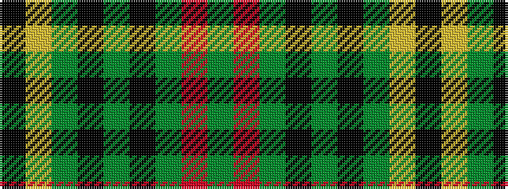

GRGKGKGYK

It is a 9 stripe tartan.

<figure class="pat-woven">

<figcaption>idealised sample</figcaption>
</figure>

## Colour Sequence



## Tartans with this colour sequence

| Tartans |
|---------------|
| [MacKillen](/variants/s9/k4lo15dg5k3dg7k3dg30r20dg3~x2/)|
||
