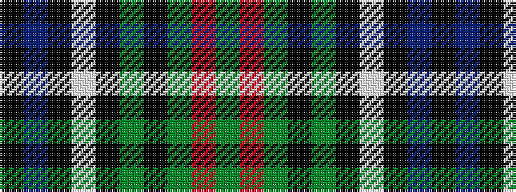

GRGKGKWKBK

It is a 10 stripe tartan.

<figure class="pat-woven">

<figcaption>idealised sample</figcaption>
</figure>

## Colour Sequence



## Tartans with this colour sequence

| Tartans |
|---------------|
| [Rutledge](/variants/s10/k3db10k2w1k2g10k2dg10r1dg1~x4/)|
||
| [Rutledge (Name)](/variants/s10/k3db10k2w1k2g10k2dg10r1dg2~x4/)|
||
