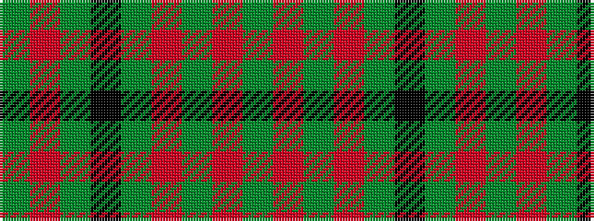

GRGKGRGRG

It is a 9 stripe tartan.

<figure class="pat-woven">

<figcaption>idealised sample</figcaption>
</figure>

## Colour Sequence



## Tartans with this colour sequence

| Tartans |
|---------------|
| [Redwoods](/setts/s9/y4r18dy2r2dy5k2dy15r1y4~x2/)|
||
