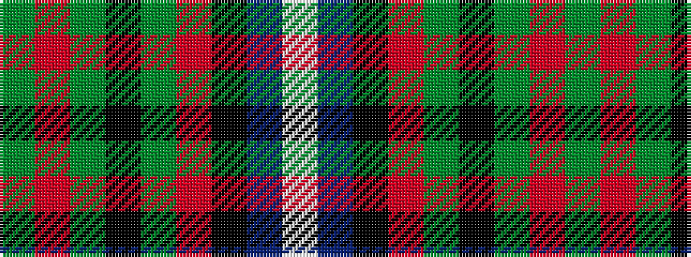

GRGKGRKBW

It is a 9 stripe tartan.

<figure class="pat-woven">

<figcaption>idealised sample</figcaption>
</figure>

## Colour Sequence



## Tartans with this colour sequence

| Tartans |
|---------------|
| [Manson](/variants/s9/dg1r24dg8k8dg8r1k4db16w1~x2/)|
||
| [Manson (Name)](/variants/s9/dg1r11dg3k4dg4r1k2db11w1~x2/)|
||
