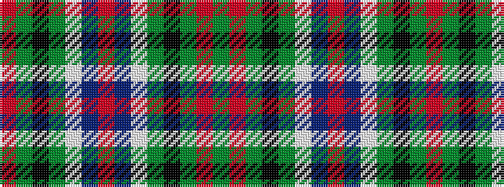

GRGKGWBRBWGKGR

It is a 14 stripe tartan.

<figure class="pat-woven">

<figcaption>idealised sample</figcaption>
</figure>

## Colour Sequence



## Tartans with this colour sequence

| Tartans |
|---------------|
| [CSCA](/setts/s14/g5r4g19k10g8w4db18r4~x2/)|
||
