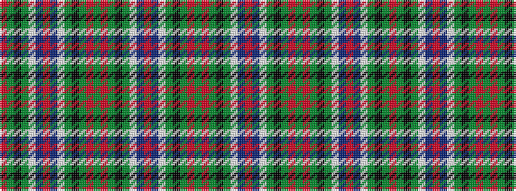

GRGKGWBRBWGKGRGRGKGWBRBWGKGR

It is a 28 stripe tartan.

<figure class="pat-woven">

<figcaption>idealised sample</figcaption>
</figure>

## Colour Sequence



## Tartans with this colour sequence

| Tartans |
|---------------|
| [Scottish Heritage USA (SHUSA)](/setts/s28/g3r2g14k6g4w2t14r2t14w2g4k6g14m2g3~x2/)|
||
