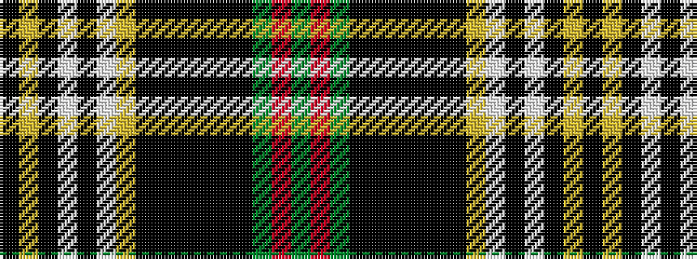

GRGKKKKKKYWKWKYK

It is a 16 stripe tartan.

<figure class="pat-woven">

<figcaption>idealised sample</figcaption>
</figure>

## Colour Sequence



## Tartans with this colour sequence

| Tartans |
|---------------|
| [Glendinning (Personal)](/variants/s16/g5r1g10k5k1k1k2k2k10ly5lb2k2lb1k2ly3k1~x2/)|
||
