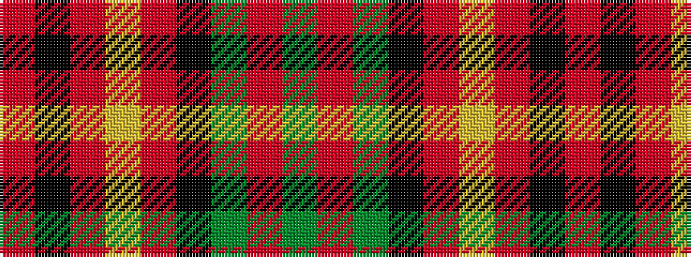

GRGKRYRKR

It is a 9 stripe tartan.

<figure class="pat-woven">

<figcaption>idealised sample</figcaption>
</figure>

## Colour Sequence



## Tartans with this colour sequence

| Tartans |
|---------------|
| [Durango](/variants/s9/o32k6r1lr1r1k4dg8o1dg3~x4/)|
||
