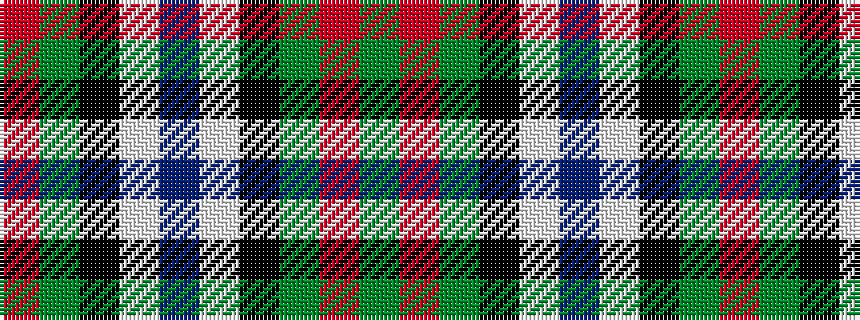

GRGKWBWKGR

It is a 10 stripe tartan.

<figure class="pat-woven">

<figcaption>idealised sample</figcaption>
</figure>

## Colour Sequence



## Tartans with this colour sequence

| Tartans |
|---------------|
| [Patterson (blue) family Tartan](/variants/s10/db22w2k10g11r3g4~x2/)|
||
