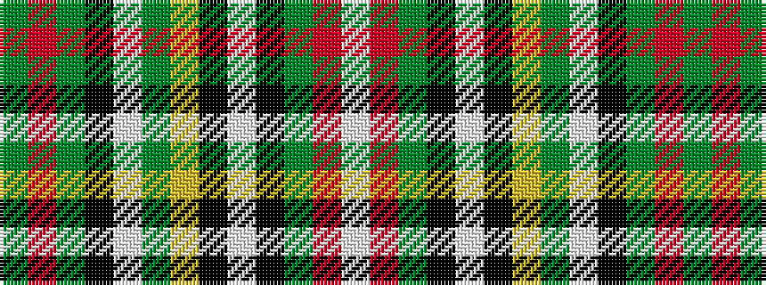

GRGKWGYKWKGRW

It is a 13 stripe tartan.

<figure class="pat-woven">

<figcaption>idealised sample</figcaption>
</figure>

## Colour Sequence



## Tartans with this colour sequence

| Tartans |
|---------------|
| [Campagna Center (Corporate)](/variants/s13/g2r36g11k5w1g1ly1k1w1k1g16r5w1~x2/)|
||
