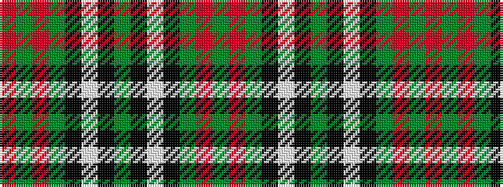

GRGKWKGKWKGRGR

It is a 14 stripe tartan.

<figure class="pat-woven">

<figcaption>idealised sample</figcaption>
</figure>

## Colour Sequence



## Tartans with this colour sequence

| Tartans |
|---------------|
| [Strang (Personal)](/variants/s14/r36g18r4g6k1lb2k1g2~x2/)|
||
