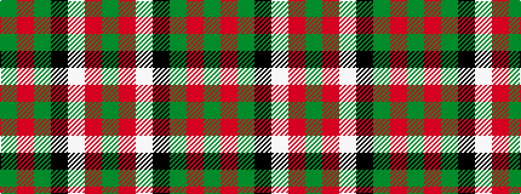

GRGKWRG

It is a 7 stripe tartan.

<figure class="pat-woven">

<figcaption>idealised sample</figcaption>
</figure>

## Colour Sequence



## Tartans with this colour sequence

| Tartans |
|---------------|
| [Pollock](/variants/s7/g3r16w4k6g28r1g3~x2/)|
||
