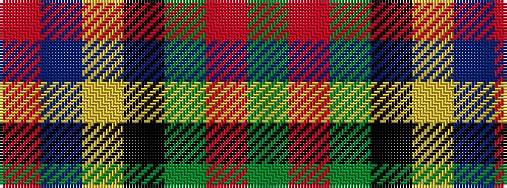

GRGKYBR

It is a 7 stripe tartan.

<figure class="pat-woven">

<figcaption>idealised sample</figcaption>
</figure>

## Colour Sequence



## Tartans with this colour sequence

| Tartans |
|---------------|
| [Ballantrae (Macnaughtons)](/variants/s7/dy6r3dy34k16ly3dt22r4~x2/)|
||
| [Sinclair Hunting](/variants/s7/dg2r1dg30k16lr1db16r2~x2/)|
||
