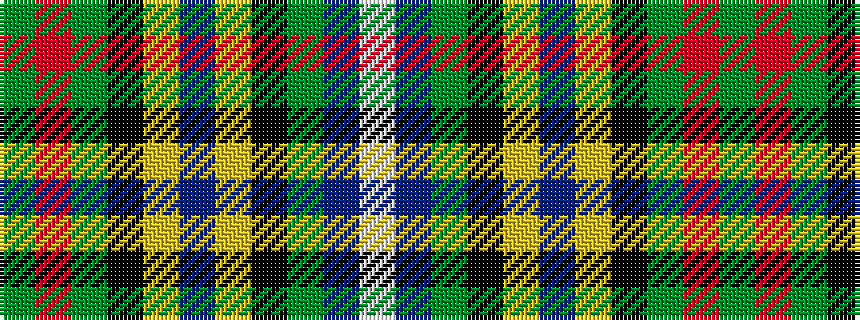

GRGKYBYKGBW

It is a 11 stripe tartan.

<figure class="pat-woven">

<figcaption>idealised sample</figcaption>
</figure>

## Colour Sequence



## Tartans with this colour sequence

| Tartans |
|---------------|
| [Livingstone (Australia) Dress](/variants/s11/dg15r25dg4k2ly1dt1ly1k2dg4dt12w1~x2/)|
||
| [Livingstone - Australia (Personal)](/variants/s11/g15r25g4k2lo1db1lo1k2g4db12w1~x2/)|
||
