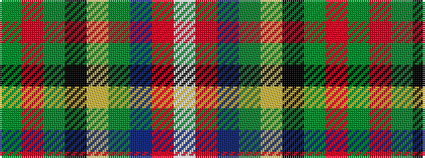

GRGKYGBRW

It is a 9 stripe tartan.

<figure class="pat-woven">

<figcaption>idealised sample</figcaption>
</figure>

## Colour Sequence



## Tartans with this colour sequence

| Tartans |
|---------------|
| [King (Austria) (Personal)](/variants/s9/w2r2db14g16ly2k2g2r35g1~x2/)|
||
