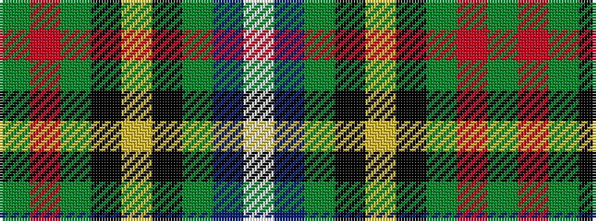

GRGKYKGBW

It is a 9 stripe tartan.

<figure class="pat-woven">

<figcaption>idealised sample</figcaption>
</figure>

## Colour Sequence



## Tartans with this colour sequence

| Tartans |
|---------------|
| [Lees-McRae College](/setts/s9/dg4r1dg12k1ly4k1dg3b5w2~x2/)|
||
