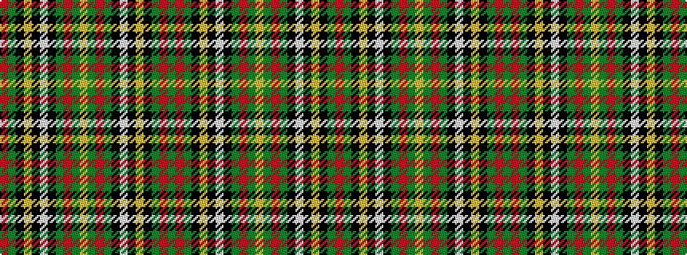

GRGKYKWKGRGYGRGKWKYKGR

It is a 22 stripe tartan.

<figure class="pat-woven">

<figcaption>idealised sample</figcaption>
</figure>

## Colour Sequence



## Tartans with this colour sequence

| Tartans |
|---------------|
| [Stewart/Stuart of Galloway (Wilsons)](/variants/s22/r52y13k16ly2k3w4k3dg23r15dg7ly3dg7r15dg23k3w4k3ly2k16y13r52dg9~x2/)|
||
