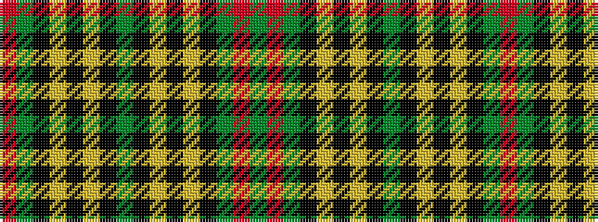

GRGKYKYKGKYKYKGR

It is a 16 stripe tartan.

<figure class="pat-woven">

<figcaption>idealised sample</figcaption>
</figure>

## Colour Sequence



## Tartans with this colour sequence

| Tartans |
|---------------|
| [Cork, County](/setts/s16/dg28r12dg4k20lo2k3lo2k3dg7~x2/)|
||
