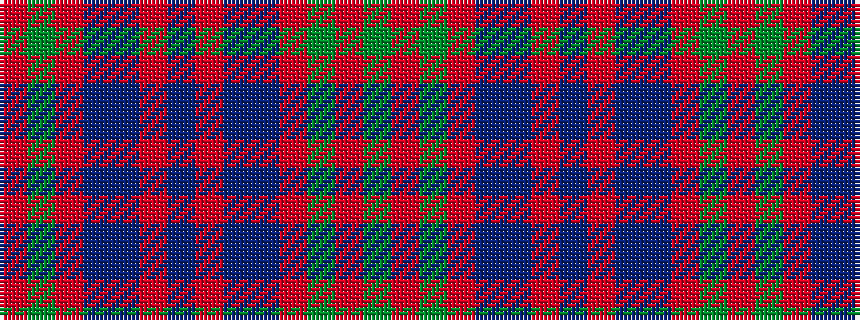

GRGRBBRBRBBRGR

It is a 14 stripe tartan.

<figure class="pat-woven">

<figcaption>idealised sample</figcaption>
</figure>

## Colour Sequence



## Tartans with this colour sequence

| Tartans |
|---------------|
| [Unidentified Coat](/variants/s14/dg6r2dg2r24t1db1r2db12r2db1t1r2dg24r2~x2/)|
||
| [Unidentified, coat](/variants/s14/g6r2g2r24t1db1r2db12r2db1t1r2g24r2~x2/)|
||
