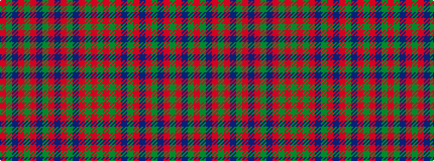

GRGRBGRBRGBRGRBGR

It is a 17 stripe tartan.

<figure class="pat-woven">

<figcaption>idealised sample</figcaption>
</figure>

## Colour Sequence



## Tartans with this colour sequence

This pattern is a design lineage: every tartan below shares one colour order, whatever its owner —
near-identical designs are grouped, the largest lineage first (#112: the pattern is a tartan's
second parent, beside its family or clan).

<table class="sett-table">
<tbody>
<tr><td><a href="/variants/s17/r24y1db1r3g16r3db1y1r3db6r3y1db1r16g2ri2g2~x4~r2109032-ri2307033/">Munro</a></td></tr>
<tr><td class="sett-swatch"></td></tr>
<tr><td><a href="/variants/s17/r24y1db1r3g16r3db1y1r3db6r3y1db1r16g2r2g2~x2/">Munro</a></td></tr>
<tr><td class="sett-swatch"></td></tr>
<tr><td><a href="/variants/s17/r19y1db1r2g18r2db1y1r2db4r2y1db1r19g2r2g2~x2/">Munro (Logan)</a></td></tr>
<tr><td class="sett-swatch"></td></tr>
<tr class="cluster-sep"><td></td></tr>
<tr><td><a href="/setts/r36y2dp1r3g41r3dp1y2r3dp12r3y2dp1r37g3ri3g4/">Lochiel (Cameron)</a></td></tr>
<tr><td class="sett-swatch"></td></tr>
<tr class="cluster-sep"><td></td></tr>
<tr><td><a href="/setts/ri24y1db1ri3g16ri3db1y1ri3db6ri3y1db1ri16g2r2g2/">Munro</a></td></tr>
<tr><td class="sett-swatch"></td></tr>
</tbody>
</table>

