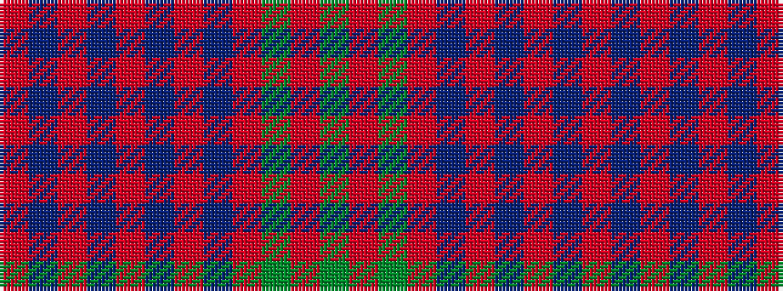

GRGRBRBRBRBR

It is a 12 stripe tartan.

<figure class="pat-woven">

<figcaption>idealised sample</figcaption>
</figure>

## Colour Sequence



## Tartans with this colour sequence

| Tartans |
|---------------|
| [MacLintock](/variants/s12/g38r3g3r3db9r3t2r40db3r3db2r6~x2/)|
||
| [MacLintock - 1880 (Clan)](/variants/s12/g36r3g3r3db9r3t2r40db3r3db2r6~x2/)|
||
