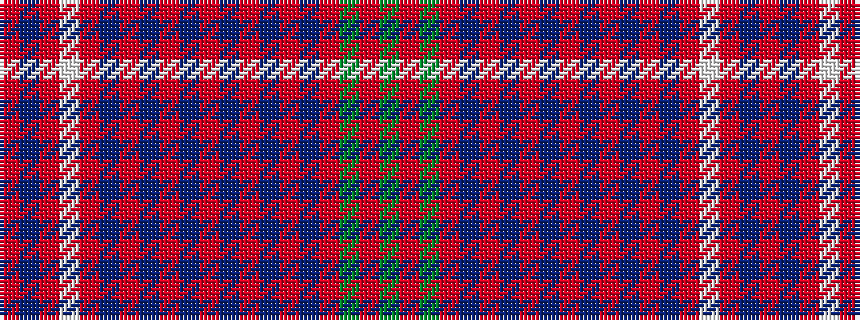

GRGRBRBRBRBRBRBRWRBR

It is a 20 stripe tartan.

<figure class="pat-woven">

<figcaption>idealised sample</figcaption>
</figure>

## Colour Sequence



## Tartans with this colour sequence

| Tartans |
|---------------|
| [MacRae of Conchra](/setts/s20/dg20r3dg20r20db3r3db6r3db3r20db3r3db6r3db3r20w3r4db20r4/)|
||
