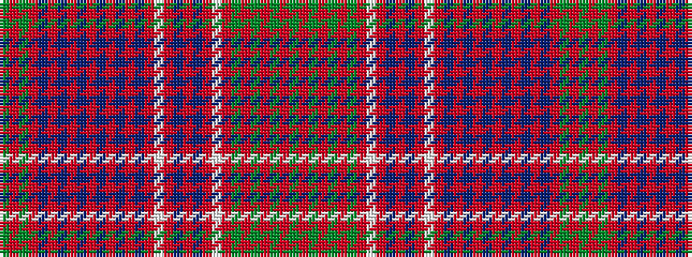

GRGRBRBRBRBRBRBRWRBRBRWRGRGRGRG

It is a 31 stripe tartan.

<figure class="pat-woven">

<figcaption>idealised sample</figcaption>
</figure>

## Colour Sequence



## Tartans with this colour sequence

| Tartans |
|---------------|
| [MacRae](/variants/s31/dg4r1dg4r4dg1r1dg1r4lb1r1db4r1db4r1lb1r4db1r1db1r1db1r4db1r1db1r1db1r4dg4r1dg4/)|
||
| [MacRae](/variants/s31/dg4r1dg4r4dg1r1dg1r4w1r1db4r1db4r1w1r4db1r1db1r1db1r4db1r1db1r1db1r4dg4r1dg4~x4/)|
||
| [MacRae (Red)](/variants/s31/g4r1g4r4db1r1db1r1db1r4db1r1db1r1db1r4w1r1db4r1db4r1w1r4g1r1g1r4g4r1g4~x4/)|
||
| [Ross #3](/variants/s31/dg23r6dg23r26dg4r9dg4r26w3r8dp31r6dp31r8w3r26dp2r2dp4r2dp2r26dp2r2dp4r2dp2r26dg23r6dg23~x2/)|
||
| [Ross 7](/variants/s31/g23r6g23r26g4r9g4r26w3r8p31r6p31r8w3r26p2r2p4r2p2r26p2r2p4r2p2r26g23r6g23~x2/)|
||
