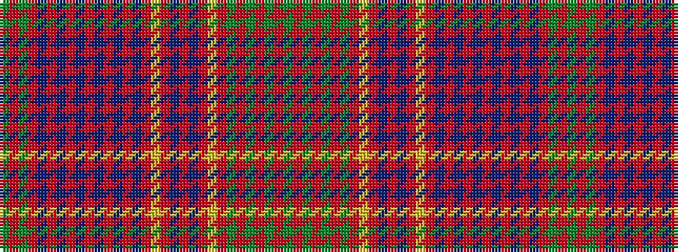

GRGRBRBRBRBRBRBRYRBRBRYRGRGRGRG

It is a 31 stripe tartan.

<figure class="pat-woven">

<figcaption>idealised sample</figcaption>
</figure>

## Colour Sequence



## Tartans with this colour sequence

| Tartans |
|---------------|
| [MacRae](/setts/s31/dg4r1dg4r4dg1r1dg1r4lr1r1db4r1db4r1lr1r4db1r1db1r1db1r4db1r1db1r1db1r4dg4r1dg4~x2/)|
||
