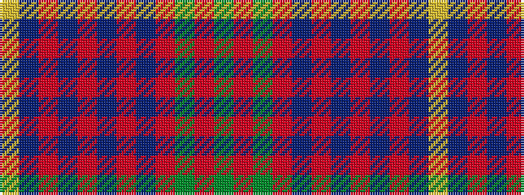

GRGRBRBRBRBY

It is a 12 stripe tartan.

<figure class="pat-woven">

<figcaption>idealised sample</figcaption>
</figure>

## Colour Sequence



## Tartans with this colour sequence

| Tartans |
|---------------|
| [Walker Family Tartan Tartan Number: 2068. Earliest known date: 1991 R.W.Hawks submitted this tartan via Phil Smith in January 1991. Hawks advised Oct. 1993 that he is agreeable for any Walkers to use this tartan. Marroon Red. See products available Copyright © Blair Urquhart, Comrie, 2015](/setts/s12/ly4dt2r7dt15r4dt3r4dt7r28dg7r6dg2/)|
||
