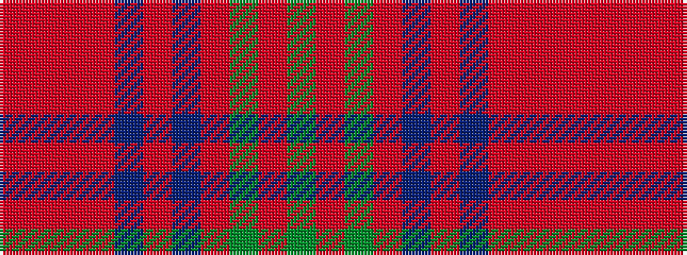

GRGRBRBRRRR

It is a 11 stripe tartan.

<figure class="pat-woven">

<figcaption>idealised sample</figcaption>
</figure>

## Colour Sequence



## Tartans with this colour sequence

| Tartans |
|---------------|
| [Unidentified #60](/setts/s11/o50o3o4o4db1o1db1o7dg7o1dg3~x4/)|
||
