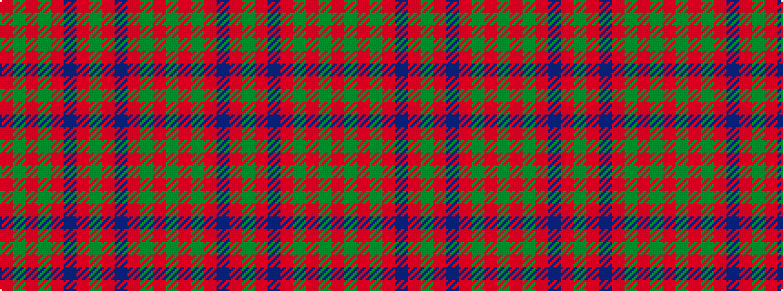

GRGRBRGRBRGRGR

It is a 14 stripe tartan.

<figure class="pat-woven">

<figcaption>idealised sample</figcaption>
</figure>

## Colour Sequence



## Tartans with this colour sequence

| Tartans |
|---------------|
| [Stewart of Urrard](/variants/s14/g6r2g2r18db9r3g3r3db9r3g24r2g2r4~x2/)|
||
| [Stewart of Urrard (Clan?)](/variants/s14/g6r2g2r18dp9r3g3r3dp9r3g24r2g2r4~x2/)|
||
| [Stuart/Stewart of Urrard](/variants/s14/dg6r2dg2r18db9r3dg3r3db9r3dg24r2dg2r4~x2/)|
||
