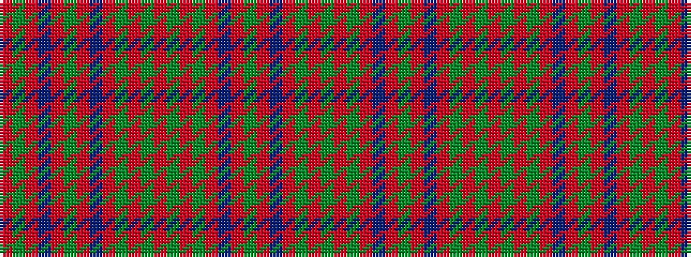

GRGRBRGRBRGRGRGRGRBRGRBRGR

It is a 26 stripe tartan.

<figure class="pat-woven">

<figcaption>idealised sample</figcaption>
</figure>

## Colour Sequence



## Tartans with this colour sequence

| Tartans |
|---------------|
| [Stewart of Killiecrankie](/variants/s26/g6r2g2r18dp9r3g3r3dp9r3g24r2g2r4~x2/)|
||
