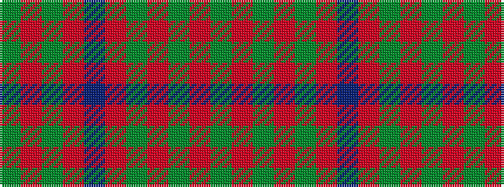

GRGRBRGRGRG

It is a 11 stripe tartan.

<figure class="pat-woven">

<figcaption>idealised sample</figcaption>
</figure>

## Colour Sequence



## Tartans with this colour sequence

| Tartans |
|---------------|
| [MacDonald of Vallay (Uist) (?)](/setts/s11/g18r3g2r2n6r2g2r24g2r2g6~x2/)|
||
| [MacDonell of Glengarry](/setts/s11/g18r3g2r2db6r2g2r24g1r2g6~x2/)|
||
| [MacDonell of Glengarry #4](/setts/s11/dg18r3dg2r2db6r2dg2r24dg1r2dg6~x2/)|
||
