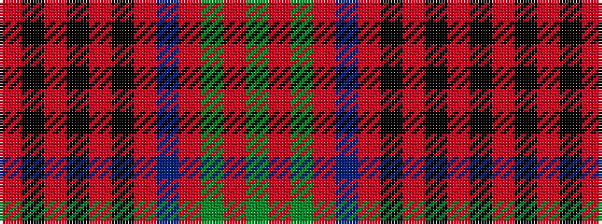

GRGRBRKRKRKR

It is a 12 stripe tartan.

<figure class="pat-woven">

<figcaption>idealised sample</figcaption>
</figure>

## Colour Sequence



## Tartans with this colour sequence

| Tartans |
|---------------|
| [California Firefighters (Corporate)](/setts/s12/o4k2r2k1r1k1r2db3o1dg4o9dg1~x4/)|
||
