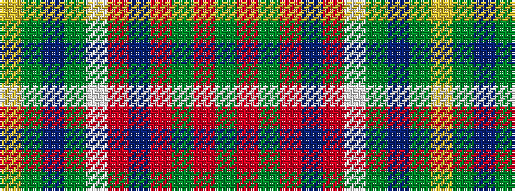

GRGRBRWGBGY

It is a 11 stripe tartan.

<figure class="pat-woven">

<figcaption>idealised sample</figcaption>
</figure>

## Colour Sequence



## Tartans with this colour sequence

| Tartans |
|---------------|
| [Hunter (USA)](/setts/s11/dg6r2dg14r14db2r14w2dg14db2dg4ly3~x2/)|
||
