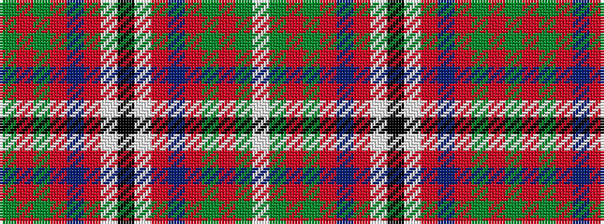

GRGRBRWKWRBRGRGW

It is a 16 stripe tartan.

<figure class="pat-woven">

<figcaption>idealised sample</figcaption>
</figure>

## Colour Sequence



## Tartans with this colour sequence

| Tartans |
|---------------|
| [Oliver Dress (Dance)](/variants/s16/g1r1g1r1db7r6w7k1w7r6db7r1g1r1g1w1~x4/)|
||
